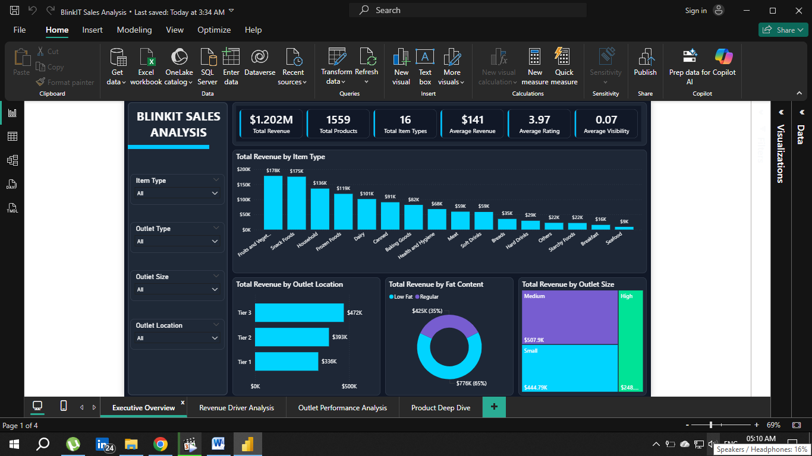
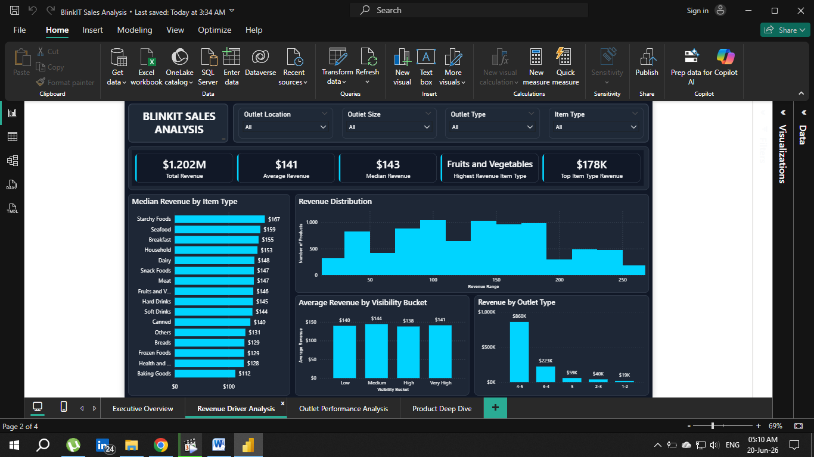
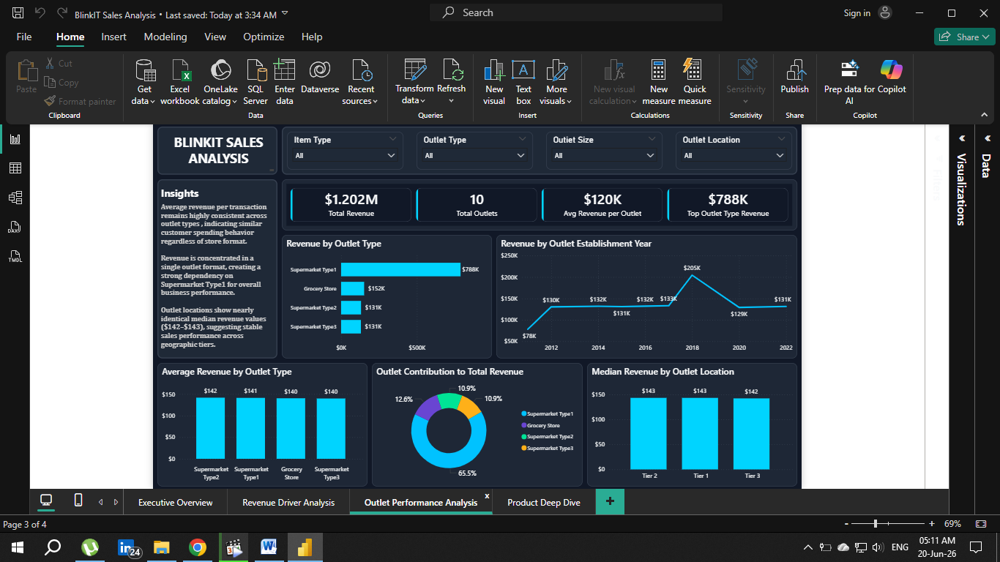
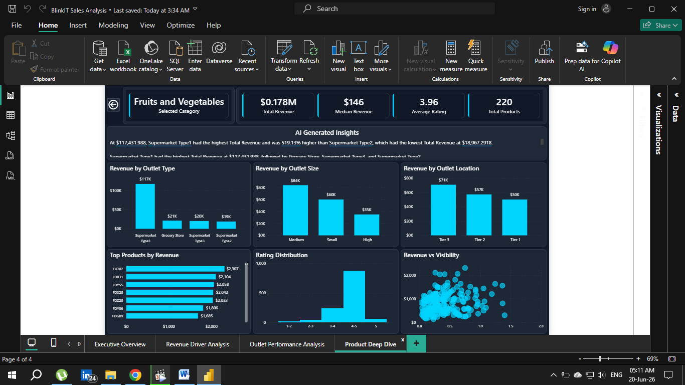

# BlinkIT Sales Analysis Dashboard

## Project Overview

This project is an end-to-end data analytics solution built to analyze BlinkIT sales performance and uncover actionable business insights. The workflow includes data cleaning, exploratory data analysis, and interactive dashboard development.

The objective was to transform raw sales data into meaningful insights that support data-driven decision-making.

---

## Business Questions

This project aims to answer questions such as:

* Which product categories generate the highest revenue?
* Which outlet types perform best?
* How do outlet size and location impact sales?
* What is the relationship between product visibility and revenue?
* How are customer ratings distributed across products?
* What factors drive overall sales performance?

---

## Project Workflow

### 1. Data Cleaning and Preparation (MySQL)

* Imported raw sales data into MySQL.
* Cleaned missing values.
* Standardized categorical fields.
* Validated data quality.
* Prepared a structured dataset for analysis.

### 2. Exploratory Data Analysis (Python)

Performed EDA using:

* Python
* Pandas
* NumPy
* Matplotlib
* Seaborn
* Jupyter Notebook

Key activities:

* Revenue analysis
* Product category analysis
* Outlet performance analysis
* Rating analysis
* Distribution analysis
* Correlation exploration

### 3. Dashboard Development (Power BI)

Built an interactive Power BI dashboard featuring:

* KPI Monitoring
* Revenue Analysis
* Outlet Performance Analysis
* Product Insights
* Interactive Filtering
* Drillthrough Navigation
* Executive-Level Reporting

---

## Dashboard Pages

### Executive Overview

Provides a high-level summary of:

* Total Revenue
* Average Revenue
* Average Rating
* Total Items Sold

### Revenue Driver Analysis

Analyzes:

* Revenue Distribution
* Revenue vs Visibility
* Top Revenue Categories
* Product Performance Drivers

### Outlet Performance Analysis

Evaluates:

* Revenue by Outlet Type
* Revenue by Outlet Size
* Revenue by Outlet Location
* Outlet Establishment Trends

---

## Tools & Technologies

### Database

* MySQL
* SQL

### Data Analysis

* Python
* Pandas
* NumPy
* Jupyter Notebook

### Visualization & BI

* Power BI
* Power Query
* DAX

---

## Skills Demonstrated

* Data Cleaning
* SQL Querying
* Exploratory Data Analysis
* Data Modeling
* DAX Calculations
* Dashboard Design
* Business Intelligence
* Data Storytelling
* KPI Development
* Interactive Reporting

---

## Repository Structure

```text
BlinkIT-Sales-Analysis/
│
├── Data/
│   └── sales_cleaned.csv
│
├── SQL/
│   └── BlinkIT_SQL_Analysis.sql
│
├── Notebook/
│   └── blinkit_sales_analysis.ipynb
│
├── PowerBI/
│   └── BlinkIT Sales Analysis.pbix
│
├── Screenshots/
│   ├── Executive_Overview.png
│   ├── Revenue_Driver_Analysis.png
│   └── Outlet_Performance_Analysis.png
│
└── README.md
```

---

## Dashboard Preview

## Executive Overview



---

## Revenue Driver Analysis



---

## Outlet Performance Analysis



---

## Product Deep Dive



---

## Key Takeaways

This project demonstrates the complete analytics lifecycle:

Raw Data → SQL Cleaning → Python Analysis → Power BI Dashboard → Business Insights

The result is an interactive business intelligence solution that helps identify revenue drivers, evaluate outlet performance, and support strategic decision-making.
